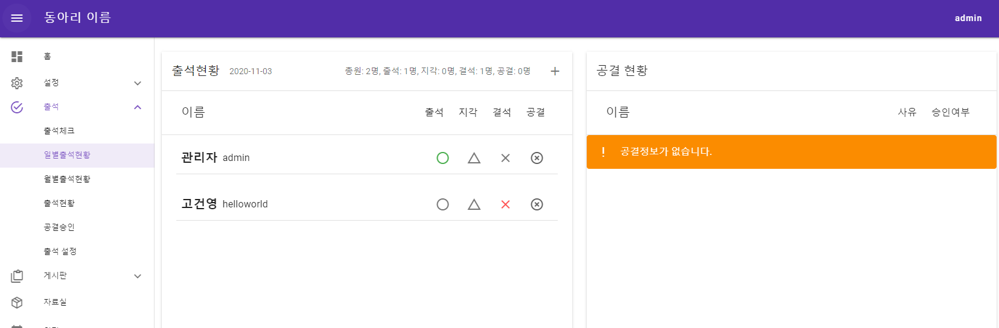
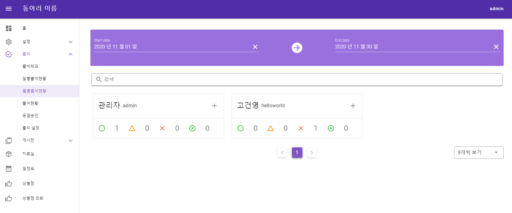
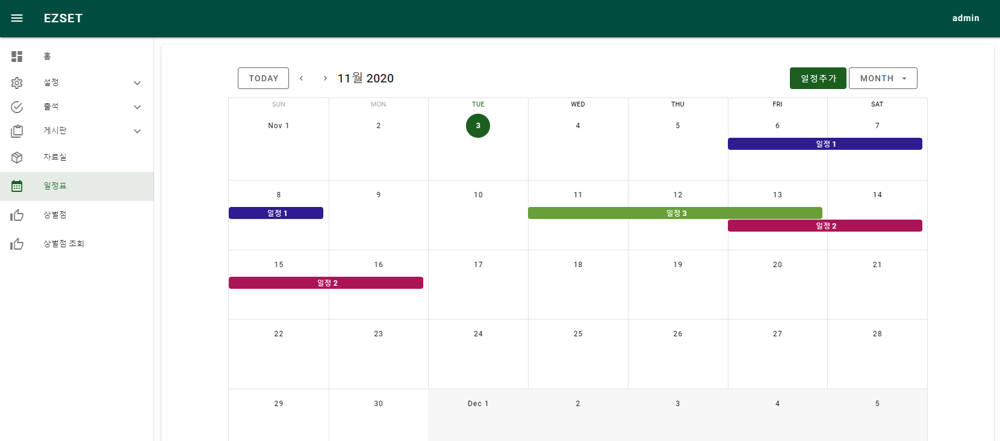
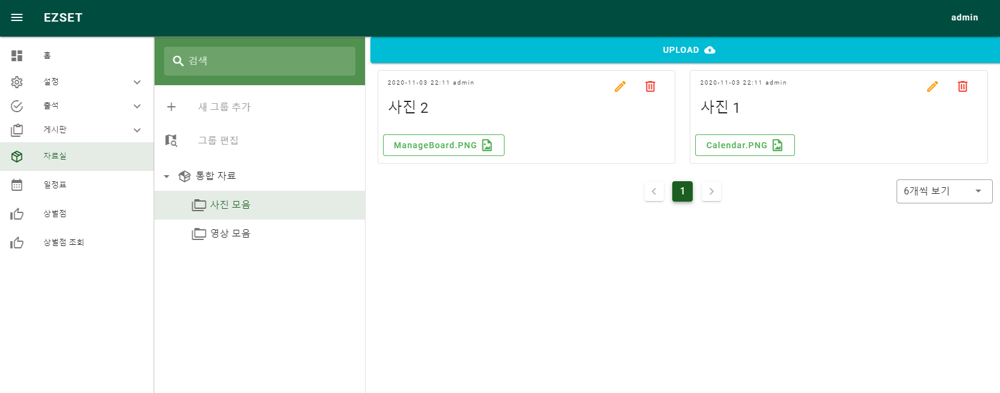
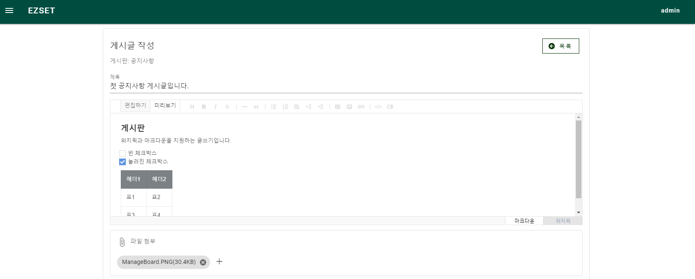
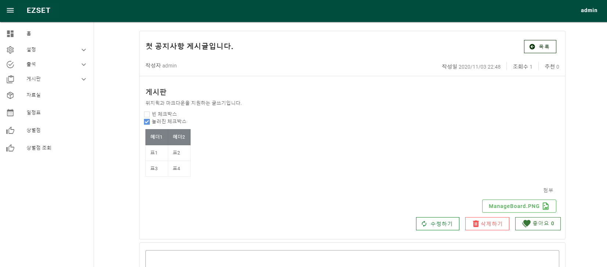

# EZSET

EZSET은 소규모 대학 동아리를 위한 그룹웨어입니다. 동아리에서 자체 서버 또는 AWS와 같은 클라우드 서버에 직접 호스팅하여 동아리 운영에 필요한 다양한 정보를 관리 할 수 있습니다.

### 주요 기능

- 실시간 출석체크
- 출결관리
- 일정관리
- 자료실
- 커뮤니티 (게시판)
- 상벌점관리

## Documentation

- [시작하기](docs/getting-started.md)
- [API Document](https://tekiter.github.io/EZSET/)

## License

이 소프트웨어는 [MIT](LICENSE) 라이선스에 의해 보호됩니다.

## Screenshots

#### 출결관리

#### 일정관리

#### 자료실

#### 게시판

